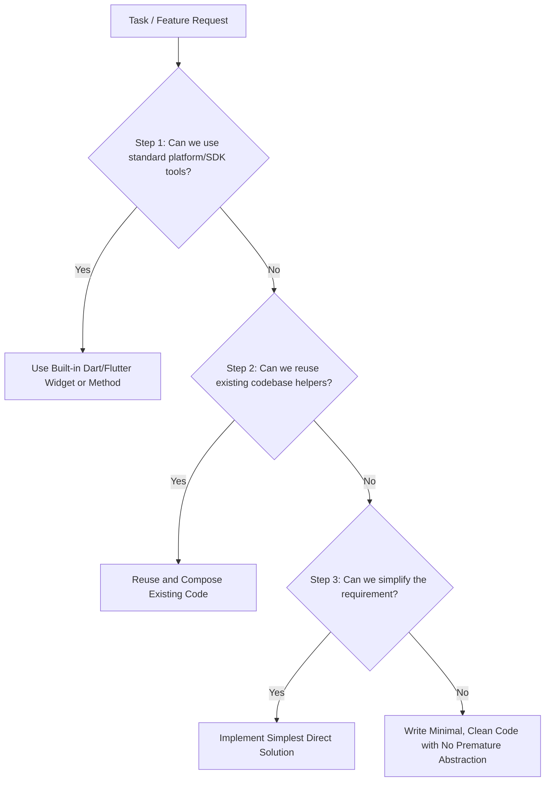

# Ponytail: Pragmatic Minimalist & YAGNI Skill

> *"The best code is the code you never had to write."*

This skill enforces strict discipline against code bloat, premature abstraction, and unnecessary library dependencies.

---

## 1. The Decision Ladder (Execute Before Writing Any Code)

Before writing any new function, widget, or class, evaluate each step of the **Decision Ladder**:

1. **Step 1: SDK & Platform Native First**
   - Use Flutter/Dart built-in features before adding third-party packages or custom complex logic.
   - Example: Use `RefreshIndicator`, `ListView.separated`, `Wrap`, `Form`, `ValueNotifier` before creating custom reactive layers.

2. **Step 2: Reuse Existing Code**
   - Check existing services (`NoteService`, `AuthService`), widgets (`NoteCard`, `EmptyStateWidget`), and helpers before building new ones.
   - Do not create duplicate helper functions across different files.

3. **Step 3: Simplify & Delete Complexity**
   - If a solution requires 5 files and 3 layers of indirection for a simple CRUD operation, flatten it.
   - Avoid creating boilerplate interfaces, factories, or abstract classes unless multiple distinct implementations actually exist today.

---

## 2. Anti-Overengineering Rules

| ❌ Avoid (Over-engineering) | ✅ Do (Ponytail Minimalist) |
| :--- | :--- |
| Adding a package for a 5-line utility function | Write a simple 5-line utility or extension method |
| Creating deep inheritance or 4-layer abstract classes | Use simple composition and direct functions |
| Premature caching, multi-tier state machines for simple forms | Use `setState` or `ValueNotifier` appropriately |
| Defensive code for impossible edge cases | Validate boundary inputs cleanly and fail early |
| Redundant wrapper widgets with zero extra behavior | Use the underlying widget directly |

---

## 3. Code Review & Refactoring Checklist

Whenever creating or reviewing changes:
- [ ] **Can any lines be deleted without breaking behavior?**
- [ ] **Is there any "just in case" speculative feature code?** (If yes, delete it immediately).
- [ ] **Is the code readable at a glance without jumping through 6 files?**
- [ ] **Are variable and function names self-documenting without needing paragraph-long comments?**
